## 개요
- 사내 보안 문제를 해결하기 위해 GitLab을 구축하여 사용하는 경우가 많음
- Docker를 사용하는 시스템에서 GitLab CI/CD 환경구성하는 내용을 정리하려 함
- CI/CD Pipeline 구성은 React 프로젝트 배포를 예시로 진행할 예정

## 해야 할 일
- GitLab 회원가입 및 Repository 생성
- React 프로젝트 생성
- GitLab Repository에 올리기
- React + Nginx 통해 docker 띄워 접속 확인
- Gitlab Runner 토큰 발급 및 등록
- gitlab-ci.yml 작성

---

### GitLab 회원가입 및 Repository 생성
1. GitLab에 접속하여 회원가입을 한다.  
  https://gitlab.com/-/trial_registrations/new
  
2. 주어진 절차에 따라 진행하면 완료된다. (Group, Repository 생성, 회사 어디 다니는지 등..)
   
3. 둘러보면 gitlab-ci.yml 에디터가 보이는데 이걸 통해서 추후에 파이프라인을 구축하게 된다.
   

### React 프로젝트 생성하기
1. 터미널 열어 create-react-app 으로 생성
   ```
   npx create-react-app {원하는 프로젝트 이름}
   ```
2. 터미널 열어 npm start로 잘 실행되는지 확인
   ```
   npm start
   ```
   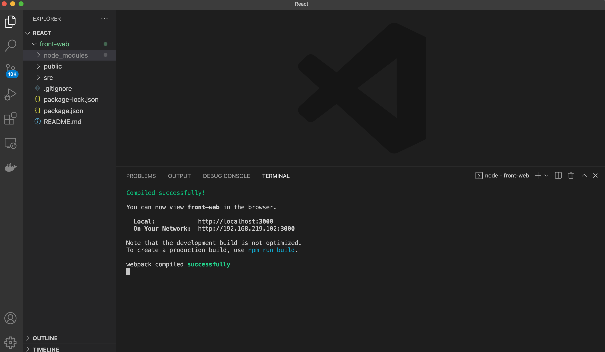
   
- 참고
  - npm이 아닌 npx create-react-app 을 쓰는 이유
  https://ljh86029926.gitbook.io/coding-apple-react/undefined/npm-npx

### GitLab Repository에 생성한 React 프로젝트 올리기
1. 프로젝트 생성한걸 GitLab에 커밋 및 푸쉬
   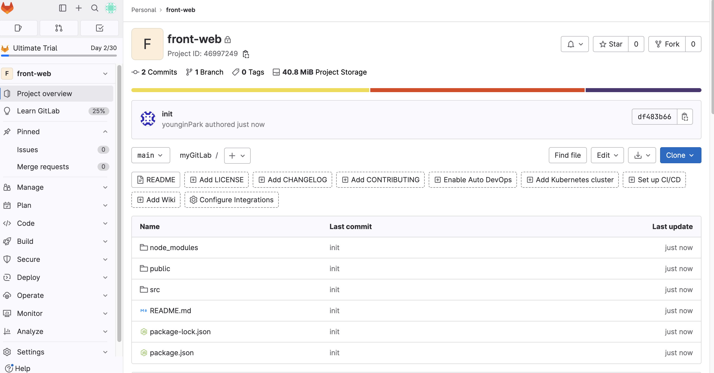

### React + Nginx 통해 docker 띄워 접속 확인
1. React 빌드 순서
   - ```npm run build```
   - ```npm install -g serve```
   - ```npx serve -s build```
   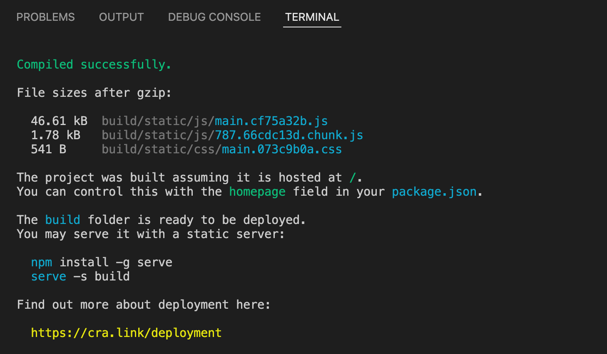
   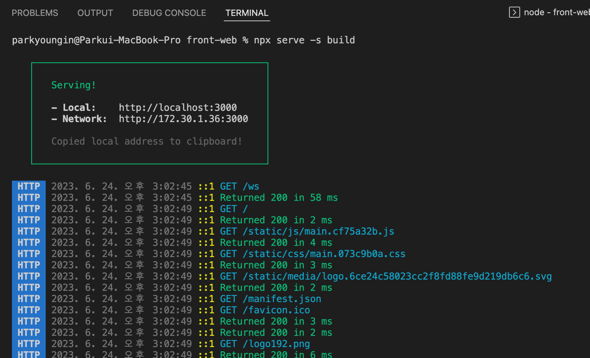
   
2. Nginx 사용해서 docker에 React 앱 띄우기
   - Nginx는 정적 파일들을 처리하는 웹서버
   - docker에서 Nginx 이미지를 사용하여 React 앱을 띄움
   - 시작
     - React 소스코드가 있는 경로에 nginx.conf 추가
      ```
      server {
         listen 80;
         access_log /var/log/nginx/access.log;
         error_log /var/log/nginx/error.log;
         location / {
            root /usr/share/nginx/html;
            index index.html index.html;
            try_files $uri $uri/ /index.html;
         }
      }
      ```
     - React 소스코드가 있는 경로에 Dockerfile 추가 (빌드, 배포 함께 진행)
      ```
      # React 빌드
      FROM node:20-alpine3.17 as build
      RUN mkdir /app
      WORKDIR /app
      COPY package*.json ./
      RUN npm install
      COPY . .
      RUN npm run build

      # Nginx를 웹서버로 배포
      FROM nginx:stable-alpine
      COPY --from=build /app/build /usr/share/nginx/html
      RUN rm /etc/nginx/conf.d/default.conf
      COPY nginx.conf /etc/nginx/conf.d
      EXPOSE 80
      CMD ["nginx", "-g", "daemon off;"]
      ```
   - Docker image 생성
     ```
     front-web % docker build -t front-web:230625 .
     ```
     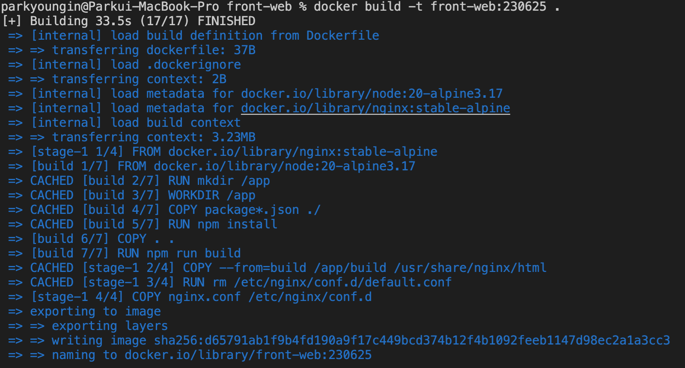
   - Docker container 실행
     ```
     docker run -d -p 3001:80 --name front-web front-web:230625
     ```
     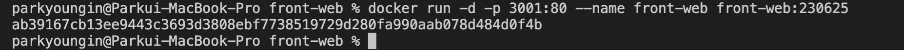
   - 브라우저 접속하여 localhost:3000 확인
    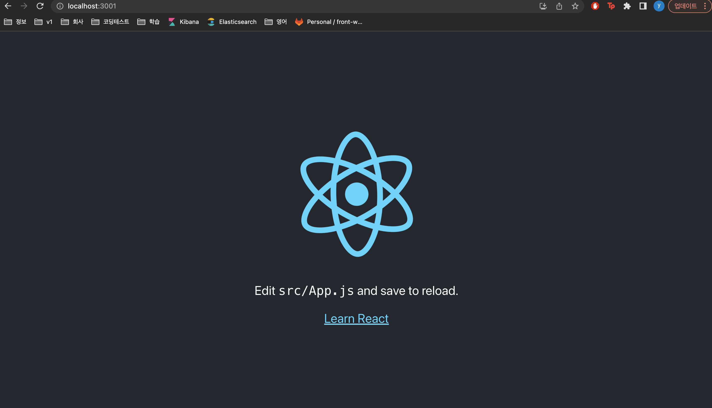

### Docker 사용하여 Gitlab runner 등록
1. GitLab에 접속하여 프로젝트 러너 생성
   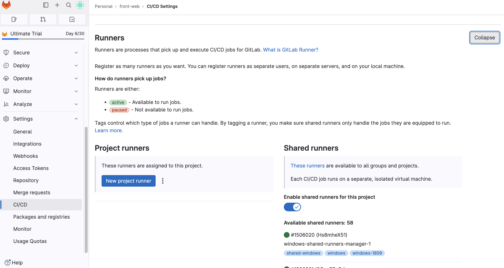
   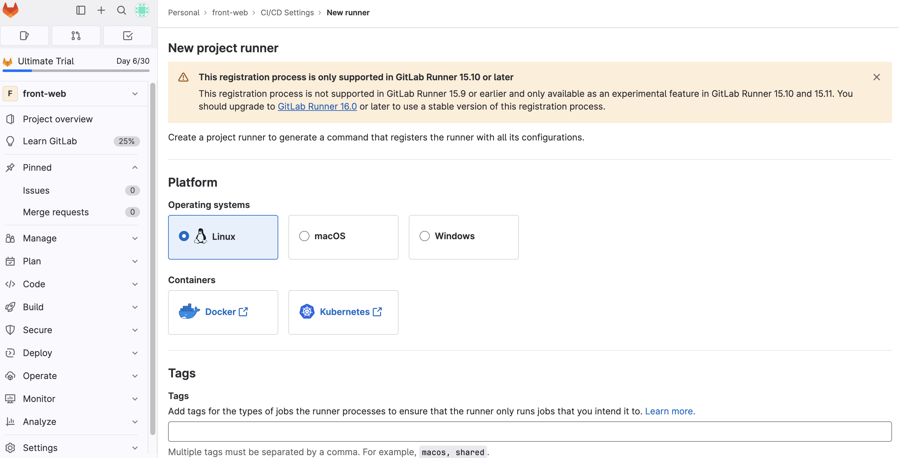
   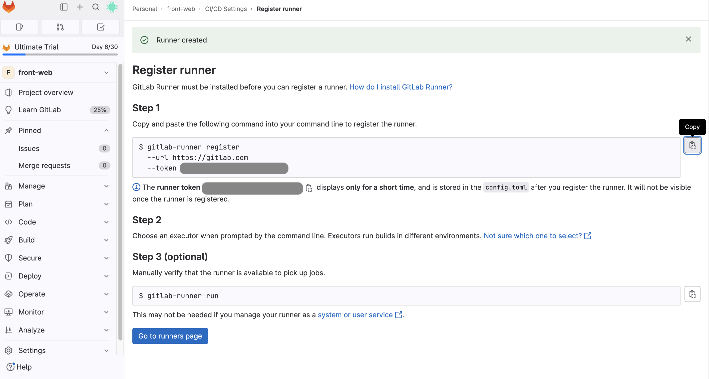
   - 세번째 이미지에서 토큰 값을 잘 저장해둔다.
2. Docker 컨테이너 백그라운드 실행 및 토큰 등록
   ```
   docker run -d --name gitlab-runner gitlab/gitlab-runner:latest
   ```
   ```
   docker exec -it gitlab-runner bash
   ```
   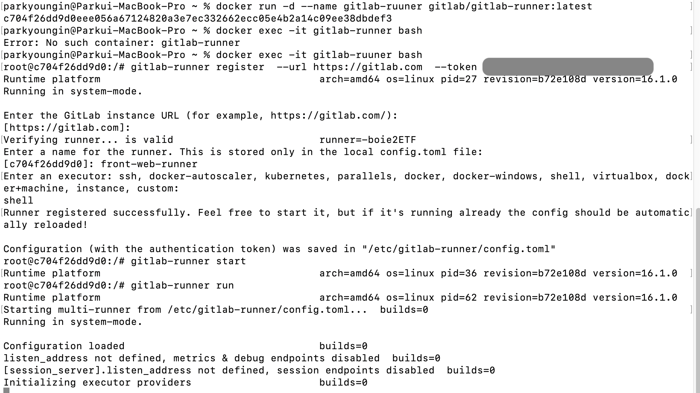
3. GitLab runner 서비스 시작
   ```
   gitlab-runner start
   ```
   ```
   gitlab-runner run
   ```
4. 잘 등록되었는지 확인
   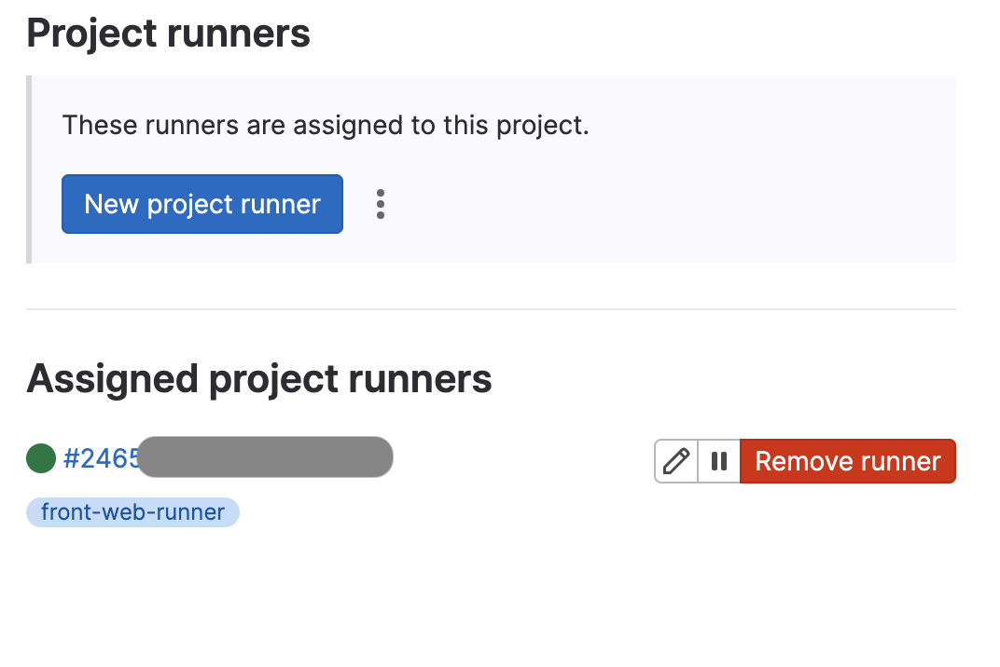