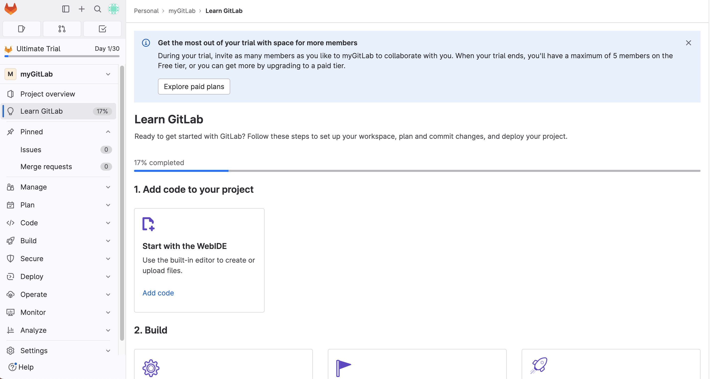
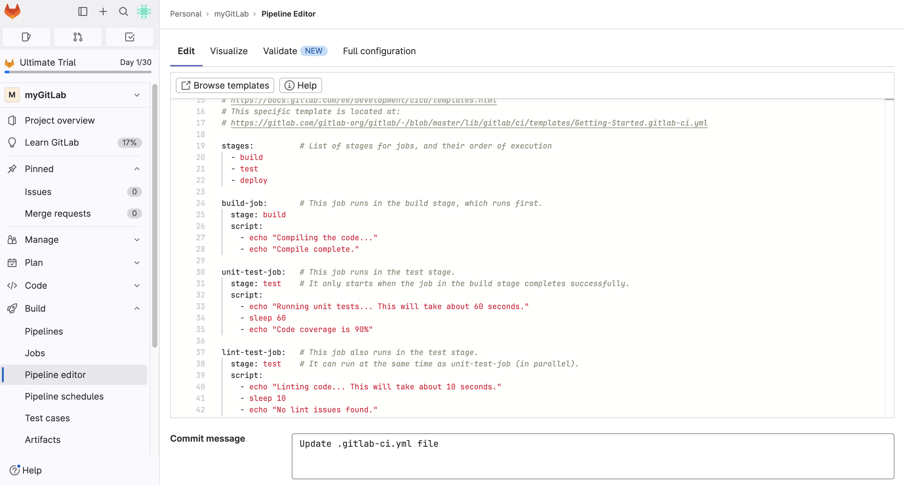

## 개요
- 사내 보안 문제를 해결하기 위해 GitLab을 구축하여 사용하는 경우가 많음
- Docker를 사용하는 시스템에서 GitLab CI/CD 환경구성하는 내용을 정리하려 함
- CI/CD Pipeline 구성은 React 프로젝트 배포를 예시로 진행할 예정

## 해야 할 일
- GitLab 회원가입 및 Repository 생성
- React 프로젝트 생성
- GitLab Repository에 올리기
- Gitlab Runner 토큰 발급
- gitlab-ci.yml 작성

### GitLab 회원가입 및 Repository 생성
1. GitLab에 접속하여 회원가입을 한다.  
  https://gitlab.com/-/trial_registrations/new
  
1. 주어진 절차에 따라 진행하면 완료된다. (Group, Repository 생성, 회사 어디 다니는지 등..)
   
2. 둘러보면 gitlab-ci.yml 에디터가 보이는데 이걸 통해서 추후에 파이프라인을 구축하게 된다.
   